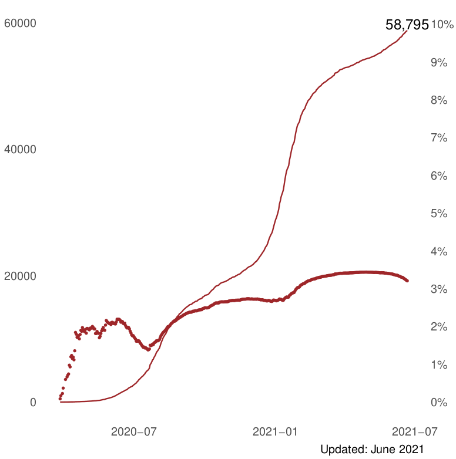
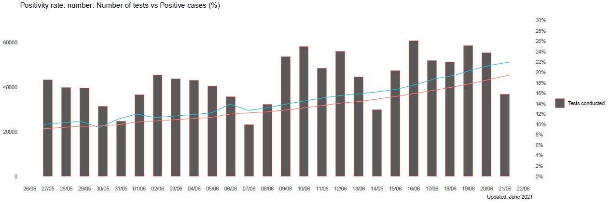

<!----------------------------------------------------------------------------------------------------------------------------------------------------->
<!-- Setup -->
<!----------------------------------------------------------------------------------------------------------------------------------------------------->
# COVID-19 Dashboard
```{r import libraries}
library(tidyverse)
library(lubridate) # dates
library(chron) # reverse date plot
library(formattable) # round numbers
library(ggplot2)
library(scales) # add commas to axis
library(RcppRoll) # rolling average
library(flexdashboard) # html dashboard formatting
library(readxl)
library(gtable) # plot table
library(gridExtra) # plot table
library(grid) # plot table
```

<!-- Custom themes -->
```{r}
custom_theme <- function () { 
    theme_minimal(base_size=12, base_family="Avenir") +
        theme(
            panel.background  = element_blank(),
            panel.grid.minor = element_blank(),
            legend.position="none", # no legend
            plot.title = element_text(size = 10, hjust = 0),
            plot.caption = element_text(size = 8, hjust = 0)
        )
}

custom_with_light_grid <- function () {
  theme_minimal(base_size=12, base_family="Avenir") +
  custom_theme() +
    theme (
      panel.grid.major.y = element_line(colour = "lightgrey"),
      panel.grid.major.x = element_blank()
    )
}

# with legend, horizontal grids
custom_line_theme <- function () { 
    theme_minimal(base_size=12, base_family="Avenir")
        theme(
            panel.background  = element_blank(),
            panel.grid.minor = element_blank(),
            plot.title = element_text(size = 10, hjust = 0),
            plot.caption = element_text(size = 8, hjust = 0),
            legend.title = element_blank() # remove legend title
        )
}

# line with light grid and legend
custom_line_light_grid <- function () {
  theme_minimal(base_size=12, base_family="Avenir") +
    theme (
      panel.grid.major.y = element_line(colour = "lightgrey"),
      panel.grid.major.x = element_blank(),
      panel.background  = element_blank(),
      panel.grid.minor = element_blank(),
      plot.title = element_text(size = 10, hjust = 0),
      plot.caption = element_text(size = 8, hjust = 0),
      legend.title = element_blank() # remove legend title
    )
}
```

<!-- Set colours according to Stellenbosch Branding manual-->
<!-- http://stbweb01.stb.sun.ac.za/centenarybrandtoolkit/SU_Brand_Manual_2019.pdf -->
```{r set colours}
maroon <- "#60223b"
mustard <- "#F1B434"
darkgrey <- "#333333"
lightgrey <- "#8c979a"
black <- "#000000"
engineering_yellow <- "#eaaa00"
arts_orange <- "#FF8F1C" # active cases
military_salmon <- "#e56a54"
science_red <- "#cb333b"
law_winered <- "#9e2629" # deaths
theology_purple <- "#84329B" # confirmed cases
education_darkblue <- "#326295"
ems_lightblue <- "#2dccd3"
agri_green <- "#509e2f" # recovered / vaccinations
med_bluegreen <- "#006163"
```

```{r set data width}
data_width_standard <- 400
```


<!-- Read data -->
```{r read data}
# general (cumulative) information regarding tests, deaths, and recoveries. Complete timeline.
tests_deaths_recoveries_data <- read.csv("data/covid19za_timeline_testing.csv")

# total (cumulative) number of confirmed cases by province
provincial_total_confirmed <- read.csv("data/covid19za_provincial_cumulative_timeline_confirmed.csv")

# provincial deaths, and recoveries
provincial_recoveries_data<- read.csv("data/covid19za_provincial_cumulative_timeline_recoveries.csv")

# lockdown levels
national_lockdown<- read.csv("data/national_lockdown_govza.csv")

# death data
death_data <- read.csv("data/covid19za_provincial_cumulative_timeline_deaths.csv")

# populations per province
province_population <- read.csv("data/province_population.csv")

# owid SA extracted (big) data
owid_sa_data <- read.csv("data/owid-covid-data_SouthAfricaExtracted_big.csv")

# vaccinations data
vaccinations_data <- read.csv("data/covid19za_timeline_vaccination.csv")

# covid tests data
testing_data <- read.csv("data/covid19za_timeline_testing.csv")

# national hospital data
national_hospital_data <- read.csv("data/za_national_hospital_admissions.csv")

# reproduction rate data
rt_data <- read.csv("data/calculated_rt_sa_provincial_cumulative.csv")

# weekly excess deaths per province 
excess_deaths_provinces_data <- read_xlsx("data/weekly_excess_deaths_provinces.xlsx")

# weekly excess deaths per metro 
excess_deahts_metros_data <- read_xlsx("data/weekly_excess_deaths_metros.xlsx")

# continental data containing confirmed cases for each country and continent
continent_data <- read.csv("data/new_cases_world.csv")
```

<!----------------------------------------------------------------------------------------------------------------------------------------------------->
<!-- Data wrangling -->
<!----------------------------------------------------------------------------------------------------------------------------------------------------->
```{r value box death and recovered}
# total deaths
grand_total_deaths <- max(tests_deaths_recoveries_data$deaths, na.rm = TRUE)

# get last day's number of deaths increase
last_death_cols <- tail(tests_deaths_recoveries_data$deaths, n=2)
death_day_update <- last_death_cols[2] - last_death_cols[1]

# total recovered
total_recovered <- max(tests_deaths_recoveries_data$recovered, na.rm = TRUE)

# percentage recovered
percentage_recovered <- total_recovered / (total_recovered + grand_total_deaths) * 100
```

```{r value box active and confirmed cases}
# total confirmed cases
total_confirmed <- max(provincial_total_confirmed$total, na.rm = TRUE)

# get last day's number of confirmed increase
last_confirmed_cols <- tail(provincial_total_confirmed$total, n=2)
confirmed_day_update <- last_confirmed_cols[2] - last_confirmed_cols[1]

# active cases = confirmed cases  - recoveries - deaths
total_active <- total_confirmed - total_recovered - grand_total_deaths
```

```{r value box tests}
# get number of tests
total_tests <- max(tests_deaths_recoveries_data$cumulative_tests, na.rm = TRUE)
# get last day's number of tests increase
last_tests_cols <- tail(tests_deaths_recoveries_data$cumulative_tests, n=2)
test_day_update <- last_tests_cols[2] - last_tests_cols[1]
```

```{r bar and line daily and total vaccinations}
# calculate daily vaccinations
vaccinations <- vaccinations_data %>%
  mutate(date = dmy(date)) %>%
  mutate(daily=vaccinations-lag(vaccinations,default=0)) %>% 
  mutate(total = vaccinations) %>%
  select(date, daily, total)
```

```{r bar daily deaths}
# calculate daily deaths
deaths_summary <- death_data %>%
  mutate(date = dmy(date)) %>%
  mutate(daily_deaths=total-lag(total,default=0)) %>%
  mutate(total_deaths = total) %>%
  select(date, daily_deaths, total_deaths)
```

```{r line faceted daily case trends}
cases <- provincial_total_confirmed %>% 
  pivot_longer(c('EC', 'FS', 'GP', 'KZN', 'LP', 'MP', 'NC', 'NW', 'WC', 'UNKNOWN'), 
               names_to = "province", values_to = "cases")
cases <- cases %>% 
  mutate(code = province) %>%
  select(date, code, cases, total)  %>% 
  filter(code != 'UNKNOWN') %>% 
  mutate(date = dmy(date)) %>%
  # calculate daily cases per province
  group_by(code) %>%
  mutate(daily_cases=cases-lag(cases,default=0)) %>%
  # calculate 7-day rolling average of daily cases
  mutate(rolling_avg = roll_mean(daily_cases, n=7, fill = NA, align = "right"))

cases_provincial <- cases %>%
  left_join(province_population, by = "code") %>%
  select(date, code, province, cases, daily_cases, rolling_avg, total)
cases_last_8_mths <- cases_provincial %>%
  filter(date >= ymd("2020-11-12"))
```

```{r total deaths and fatality rate - generates PDF}
# generates a PDF with the deaths and fatality rate graph (output image added to dashboard in Data Visualisation section)

# total confirmed cases in SA
confirmed_cases <- provincial_total_confirmed %>%
  mutate(date = dmy(date)) %>%
  mutate(total_confirmed_cases = total) %>%
  select(date, total_confirmed_cases)

# add confirmed cases and fatality rate to deaths df 
total_deaths_summary <- deaths_summary %>%
  left_join(confirmed_cases, by="date") %>%
  mutate(fatality_rate = 100*(total_deaths / total_confirmed_cases))

# plot total deaths
p1 <- ggplot() + 
  geom_line(data=total_deaths_summary, aes(date, total_deaths), color="#9e2629") +
  geom_text(aes(x = date, y = total_deaths, label = format(total_deaths, big.mark = ",")), 
              data = tail(total_deaths_summary, 1), nudge_y = 1000) +
  labs(caption = "Updated: 21 June 2021",
       x = NULL, y = NULL) +
  theme_minimal() +  
  theme(panel.grid = element_blank())
# plot fatality rate
p2 <- ggplot(data=total_deaths_summary, aes(date, fatality_rate)) + 
  geom_point(color="#9e2629", size = 0.5) +
  labs(caption = "Updated: 21 June 2021",
       x = NULL, y = NULL) +
  scale_y_continuous(breaks = seq(0, 10, by = 1), limits = c(0, 10), labels = function(x) paste0(x, '%')) +
  theme_minimal() +  
  theme(panel.grid = element_blank())

# overlay death and cfr plots

# adapted from https://drawar.github.io/posts/dual-y-axis-ggplot2/

# Get the plot grobs
g1 <- ggplotGrob(p1)
g2 <- ggplotGrob(p2)

# Get the locations of the plot panels in g1.
pp <- c(subset(g1$layout, name == "panel", se = t:r))

# Overlap panel for second plot on that of the first plot
g1 <- gtable_add_grob(g1, g2$grobs[[which(g2$layout$name == "panel")]], pp$t, pp$l, pp$b, pp$l)

# ggplot contains many labels that are themselves complex grob; 
# usually a text grob surrounded by margins.
# When moving the grobs from, say, the left to the right of a plot,
# make sure the margins and the justifications are swapped around.
# The function below does the swapping.
# Taken from the cowplot package:
# https://github.com/wilkelab/cowplot/blob/master/R/switch_axis.R 
hinvert_title_grob <- function(grob){

# Swap the widths
widths <- grob$widths
grob$widths[1] <- widths[3]
grob$widths[3] <- widths[1]
grob$vp[[1]]$layout$widths[1] <- widths[3]
grob$vp[[1]]$layout$widths[3] <- widths[1]

# Fix the justification
grob$children[[1]]$hjust <- 1 - grob$children[[1]]$hjust 
grob$children[[1]]$vjust <- 1 - grob$children[[1]]$vjust 
grob$children[[1]]$x <- unit(1, "npc") - grob$children[[1]]$x
grob
}

# Get the y axis from g2 (axis line, tick marks, and tick mark labels)
index <- which(g2$layout$name == "axis-l")  # Which grob
yaxis <- g2$grobs[[index]]                  # Extract the grob

# Second, swap tick marks and tick mark labels
ticks <- yaxis$children[[2]]
ticks$widths <- rev(ticks$widths)
ticks$grobs <- rev(ticks$grobs)

# Third, move the tick marks
# Tick mark lengths can change. 
# A function to get the original tick mark length
# Taken from the cowplot package:
# https://github.com/wilkelab/cowplot/blob/master/R/switch_axis.R 
plot_theme <- function(p) {
plyr::defaults(p$theme, theme_get())
}

tml <- plot_theme(p1)$axis.ticks.length   # Tick mark length

# Fourth, swap margins and fix justifications for the tick mark labels
ticks$grobs[[2]] <- hinvert_title_grob(ticks$grobs[[2]])

# Fifth, put ticks back into yaxis
yaxis$children[[2]] <- ticks

# Put the transformed yaxis on the right side of g1
g1 <- gtable_add_cols(g1, g2$widths[g2$layout[index, ]$l], pp$r)
g1 <- gtable_add_grob(g1, yaxis, pp$t, pp$r + 1, pp$b, pp$r + 1, clip = "off", name = "axis-r")

# Turn off clipping in the plot panel
g1$layout[which(g1$layout$name == "panel"), ]$clip = "off"

# Print to PDF
ggsave("output/deaths_and_fatality.pdf", g1, width=5, height=5)
```

```{r bar deaths by province}
total_deaths_province <- tail(death_data, 1) %>% 
  pivot_longer(c('EC', 'FS', 'GP', 'KZN', 'LP', 'MP', 'NC', 'NW', 'WC', 'UNKNOWN'), 
               names_to = "province", values_to = "deaths")
total_deaths_province <- total_deaths_province %>% 
  select(date, province, deaths, total)  %>% 
  filter(province != 'UNKNOWN') %>% 
  mutate(date = dmy(date)) %>% 
  arrange(desc(deaths))

# keep order when plotting
total_deaths_province$province <- factor(total_deaths_province$province, levels = total_deaths_province$province)
```

```{r bar deaths by province per 100k}
total_deaths_100k <- total_deaths_province %>%  
  mutate(code = province) %>%  # format so the column names are the same to be able to join the dataframes
  mutate(provincial_deaths = deaths) %>%
  select(!province) %>%
  select(!deaths)

# join dataframes so total_deaths includes province populations
total_deaths_100k <- total_deaths_100k %>%
  left_join(province_population, by = "code") 
# add deaths per 100k
total_deaths_100k <- total_deaths_100k %>%
  mutate(deaths_per_100k = round(100000 * provincial_deaths / population, digits=2)) %>%
  arrange(desc(provincial_deaths))

# keep order when plotting
total_deaths_100k$province <- factor(total_deaths_100k$province, levels = total_deaths_100k$province)
total_deaths_100k$code <- factor(total_deaths_100k$code, levels = total_deaths_100k$code)

```

```{r bar provincial infections per 100k}
total_cases_100k <- tail(cases, 9) # cumulative cases per province up to 21 June 2021
# add province populations to province cases
total_cases_100k <- total_cases_100k %>%
  ungroup() %>%
  select(code, cases) %>%
  left_join(province_population, by = "code") %>% 
  select(code, province, cases, population) %>%
  # calculate infections per 100k population
  mutate(cases_per_100k = round(100000 * cases / population, digits=2)) %>% 
  arrange(cases_per_100k)

# keep order when plotting
total_cases_100k$province <- factor(total_cases_100k$province, levels = total_cases_100k$province) 
```

```{r avg daily tests per week}
testing <- testing_data %>%
  mutate(date = dmy(date)) %>%
  # calculate daily tests
  mutate(daily_tests=cumulative_tests-lag(cumulative_tests,default=0)) %>%
  mutate(week = week(date)) %>%
  select(date, week, daily_tests, cumulative_tests)

# add rolling average to the data
testing_avg <- testing %>%
  mutate(rolling_avg = roll_mean(daily_tests, n=7, fill = NA, align = "right")) %>%
  mutate(rolling_avg = round(rolling_avg)) %>%
# reduce data to start in April 2020 and include weekly average
  filter(date - ymd("2020-4-9") >= 0)

testing_avg <- testing_avg %>%
  filter(as.numeric(date - ymd("2020-4-9")) %% 7 == 0)
```

```{r avg daily positives per week}
daily_cases <- provincial_total_confirmed %>%
  mutate(date = dmy(date)) %>%
  mutate(total_cases = total) %>%
  select(date, total_cases) %>%
  mutate(daily_cases=total_cases-lag(total_cases,default=0))

# add rolling average to the data
daily_cases_avg <- daily_cases %>%
  mutate(rolling_avg = roll_mean(daily_cases, n=7, fill = NA, align = "right")) %>%
  mutate(rolling_avg = round(rolling_avg))
  
# reduce data to start in April 2020 and include weekly average
weekly_avg_daily_cases <- daily_cases_avg %>%
  filter(date - ymd("2020-4-9") >= 0)

weekly_avg_daily_cases <- weekly_avg_daily_cases %>%
  filter(as.numeric(date - ymd("2020-4-9")) %% 7 == 0)
```

```{r num tests per positive case weekly}
testing_avg <- testing_avg %>%
  mutate(testing_rolling_avg = rolling_avg)
weekly_avg_daily_cases <- weekly_avg_daily_cases %>%
  mutate(confirmed_rolling_avg = rolling_avg)

tests_per_positive <- testing_avg %>% 
  inner_join(weekly_avg_daily_cases, by="date") %>% 
  select(date, testing_rolling_avg, confirmed_rolling_avg)
tests_per_positive$ratio <- with(tests_per_positive, testing_rolling_avg / confirmed_rolling_avg)
```

```{r bubble new tests and cases}
bubble_data <- owid_sa_data %>% 
  select(date, new_cases, new_tests) %>% 
  filter(!is.na(new_cases)) %>% 
  filter(!is.na(new_tests)) %>% 
  mutate(date = as.Date(date))
```

```{r last 20 days new cases}
# Get total confirmed cases per date
confirmed_20 <- owid_sa_data %>% 
  filter(!is.na(new_cases)) %>% 
  select(date, new_cases) %>% 
  mutate(date = as.Date(date)) %>% 
  filter(date > as.Date("2021-06-01"))
confirmed_20 <- confirmed_20 %>% map_df(rev) 
```

```{r positivity rate - generated PDF}
# generates a PDF with the positivity rate graph (output image added to dashboard in Data Visualisation section)
positive_rate_data <- owid_sa_data %>% 
  select(date, new_tests, positive_rate, tests_per_case) %>% 
  filter(!is.na(new_tests)) %>% 
  filter(!is.na(positive_rate)) %>% 
  filter(!is.na(tests_per_case)) %>% 
  mutate(date = as.Date(date)) %>% 
  filter(date > as.Date("2021-05-20"))

positive_rate_data <- positive_rate_data %>%
  mutate(rolling_avg = roll_mean(positive_rate, n=7, fill = NA, align = "right")) %>% 
  filter(!is.na(rolling_avg))

# plot new tests
p1 <- ggplot(positive_rate_data, aes(date)) + 
  geom_col(aes(y = new_tests, colour = "Tests conducted"), width=0.5, position=position_dodge(0.5)) +
  # geom_line(aes(y = rolling_avg, colour = "Confirmed Cases")) +
  labs(title= "Positivity rate: number: Number of tests vs Positive cases (%)",
     caption = "Updated: June 2021",
     x = NULL,
     y = NULL) +
  scale_color_discrete(name="") + # remove legend title
  scale_x_date(date_breaks = "1 day", date_labels = "%d/%m") +
  coord_cartesian(ylim = c(0, 70000)) +
  theme_minimal() +  
  theme(panel.grid.minor = element_blank(), 
  panel.grid.major = element_blank())

# plot positive rate and rolling average
p2 <- ggplot(positive_rate_data, aes(date)) + 
  geom_line(aes(y = positive_rate, colour = "Positivity rate")) +
  geom_line(aes(y = rolling_avg, colour = "7-day rolling average")) +
  labs(title= "Positivity rate: number: Number of tests vs Positive cases (%)",
     caption = "Updated: June 2021",
     x = NULL,
     y = NULL) +
  scale_color_discrete(name="") + # remove legend title
  scale_x_date(date_breaks = "2 days", date_labels = "%d/%m") +
  coord_cartesian(ylim = c(0, 0.3)) +
  scale_y_continuous(labels = scales::percent_format(accuracy = 1L), breaks=seq(0, 0.3, by=0.02)) +
  theme_minimal() +  
  theme(panel.grid.minor = element_blank(), 
  panel.grid.major = element_blank()) 

# overlay positivity rate and nr of tests plots

# adapted from https://drawar.github.io/posts/dual-y-axis-ggplot2/

# Get the plot grobs
g1 <- ggplotGrob(p1)
g2 <- ggplotGrob(p2)

# Get the locations of the plot panels in g1.
pp <- c(subset(g1$layout, name == "panel", se = t:r))

# Overlap panel for second plot on that of the first plot
g1 <- gtable_add_grob(g1, g2$grobs[[which(g2$layout$name == "panel")]], pp$t, pp$l, pp$b, pp$l)

# ggplot contains many labels that are themselves complex grob; 
# usually a text grob surrounded by margins.
# When moving the grobs from, say, the left to the right of a plot,
# make sure the margins and the justifications are swapped around.
# The function below does the swapping.
# Taken from the cowplot package:
# https://github.com/wilkelab/cowplot/blob/master/R/switch_axis.R 
hinvert_title_grob <- function(grob){

# Swap the widths
widths <- grob$widths
grob$widths[1] <- widths[3]
grob$widths[3] <- widths[1]
grob$vp[[1]]$layout$widths[1] <- widths[3]
grob$vp[[1]]$layout$widths[3] <- widths[1]

# Fix the justification
grob$children[[1]]$hjust <- 1 - grob$children[[1]]$hjust 
grob$children[[1]]$vjust <- 1 - grob$children[[1]]$vjust 
grob$children[[1]]$x <- unit(1, "npc") - grob$children[[1]]$x
grob
}

# Get the y axis from g2 (axis line, tick marks, and tick mark labels)
index <- which(g2$layout$name == "axis-l")  # Which grob
yaxis <- g2$grobs[[index]]                  # Extract the grob


# Second, swap tick marks and tick mark labels
ticks <- yaxis$children[[2]]
ticks$widths <- rev(ticks$widths)
ticks$grobs <- rev(ticks$grobs)

# Third, move the tick marks
# Tick mark lengths can change. 
# A function to get the original tick mark length
# Taken from the cowplot package:
# https://github.com/wilkelab/cowplot/blob/master/R/switch_axis.R 
plot_theme <- function(p) {
plyr::defaults(p$theme, theme_get())
}

tml <- plot_theme(p1)$axis.ticks.length   # Tick mark length

# Fourth, swap margins and fix justifications for the tick mark labels
ticks$grobs[[2]] <- hinvert_title_grob(ticks$grobs[[2]])

# Fifth, put ticks back into yaxis
yaxis$children[[2]] <- ticks

# Put the transformed yaxis on the right side of g1
g1 <- gtable_add_cols(g1, g2$widths[g2$layout[index, ]$l], pp$r)
g1 <- gtable_add_grob(g1, yaxis, pp$t, pp$r + 1, pp$b, pp$r + 1, clip = "off", name = "axis-r")

# Turn off clipping in the plot panel
g1$layout[which(g1$layout$name == "panel"), ]$clip = "off"

# Print to PDF
ggsave("output/positivity_rate.pdf", g1, width=15, height=5)
```

```{r daily confirmed cases with lockdown and 7-day average}
confirmed_lockdown <- provincial_total_confirmed %>% 
  select(date, total) %>% 
  mutate(date = dmy(date)) 

# get daily confirmed cases
confirmed_summary <- provincial_total_confirmed %>%
  select(date, total) %>%
  mutate(date = dmy(date)) %>%
  mutate(daily_confirmed=total-lag(total,default=0))
names(confirmed_summary)[names(confirmed_summary) == 'total'] <- 'total_confirmed'

# 7-day rolling average
confirmed_rolling_average <- confirmed_lockdown %>%
  mutate(daily_cases=total-lag(total,default=0)) %>%
  mutate(rolling_avg = roll_mean(daily_cases, n=7, fill = NA, align = "right"))

confirmed_summary <- confirmed_summary %>% 
  inner_join(confirmed_rolling_average, by = "date")

# lockdown levels
national_lockdown <- national_lockdown %>% 
  mutate(date_start = as.Date(date_start)) %>% 
  mutate(date_end = as.Date(date_end)) 

# lockdown segments
segment1 = data.frame(time = seq(national_lockdown$date_start[1], national_lockdown$date_end[1], by = "1 day"))
segment2 = data.frame(time = seq(national_lockdown$date_start[2], national_lockdown$date_end[2], by = "1 day"))
segment3 = data.frame(time = seq(national_lockdown$date_start[3], national_lockdown$date_end[3], by = "1 day"))
segment4 = data.frame(time = seq(national_lockdown$date_start[4], national_lockdown$date_end[4], by = "1 day"))
segment5 = data.frame(time = seq(national_lockdown$date_start[5], national_lockdown$date_end[5], by = "1 day"))
segment6 = data.frame(time = seq(national_lockdown$date_start[6], national_lockdown$date_end[6], by = "1 day"))
segment7 = data.frame(time = seq(national_lockdown$date_start[7], national_lockdown$date_end[7], by = "1 day"))
segment8 = data.frame(time = seq(national_lockdown$date_start[8], national_lockdown$date_end[8], by = "1 day"))
segment9 = data.frame(time = seq(national_lockdown$date_start[9], national_lockdown$date_end[9], by = "1 day"))
```

```{r active cases (confirmed, death and recovery data used)}
# recovery
recovery_summary <- tests_deaths_recoveries_data %>%
  select(date, recovered) %>%
  mutate(date = dmy(date)) %>%
  mutate(daily_recovered=recovered-lag(recovered,default=0))
names(recovery_summary)[names(recovery_summary) == 'recovered'] <- 'total_recovered'

# active
active_df <- recovery_summary %>% 
  inner_join(deaths_summary, by = "date") %>% 
  inner_join(confirmed_summary, by = "date")
active_df$total_active <- with(active_df, total_confirmed - total_deaths - total_recovered)

active_confirmed_summary <- active_df %>%
  select(date, total_active, total_confirmed, daily_confirmed, total_deaths, daily_deaths) %>%
  mutate(daily_active=total_active-lag(total_active,default=0))
```

```{r confirmed vs active per province (confirmed, death, recovery data used)}
# provincial deaths
provincial_deaths <- death_data %>% pivot_longer(c('EC', 'FS', 'GP', 'KZN', 'LP', 'MP', 'NC', 'NW', 'WC', 'UNKNOWN'), names_to = "province", values_to = "deaths")
provincial_deaths <- provincial_deaths %>%
  select(date, province, deaths, total)  %>%
  filter(province != 'UNKNOWN') %>%
  mutate(date = dmy(date))

# provincial recoveries
provincial_recoveries <- provincial_recoveries_data %>% pivot_longer(c('EC', 'FS', 'GP', 'KZN', 'LP', 'MP', 'NC', 'NW', 'WC', 'UNKNOWN'), names_to = "province", values_to = "recoveries")
provincial_recoveries <- provincial_recoveries %>%
  group_by(province) %>%
  select(date, province, recoveries, total)  %>%
  filter(province != 'UNKNOWN') %>%
  mutate(date = dmy(date)) %>% 
  summarise(date = date, recoveries = recoveries)

# inner_join() joins based on matching keys (we only want overlapping dates)
provincial_active <- cases %>% 
  mutate(province = code) %>%
  inner_join(provincial_recoveries, by = c("province", "date")) %>% 
  inner_join(provincial_deaths, by = c("province", "date"))

# get active cases per province
provincial_active$active <- with(provincial_active, cases - recoveries - deaths)
provincial_active <- provincial_active %>%
  select(date, province, cases, recoveries, deaths, active)

# add full name of province
province_names <- province_population %>%
  select(code, province)
provincial_active <- provincial_active %>%
  mutate(code = province) %>%
  select(!province) %>%
  left_join(province_names, by = "code")
```

```{r national hospital admissions}
national_hospital_data <- national_hospital_data %>% 
  mutate(week_start = as.Date(week_start))
```

```{r reproduction estimates for south africa}
rt_summary <- rt_data %>%
  select(state, date, ML) %>%
  mutate(date = as.Date(date)) %>%
  filter(state=="Total RSA")

rolling_avg_rt <- rt_summary %>%
  mutate(rolling_avg = roll_mean(ML, n=7, fill = NA, align = "right"))

rt_summary <- rt_summary %>% 
  inner_join(rolling_avg_rt, by = "date")
```

```{r excess deaths (south africa)}
excess_deaths_provinces_data <- excess_deaths_provinces_data %>%
  mutate(date = ymd(date))

# look at the three time intervals
may3_june5 <- excess_deaths_provinces_data %>%
  filter(date <= ymd("2021-06-05")) %>%
  select(date, RSA)

may3_june12 <- excess_deaths_provinces_data %>%
  filter(date <= ymd("2021-06-12")) %>%
  select(date, RSA)

may3_june19 <- excess_deaths_provinces_data %>%
  filter(date <= ymd("2021-06-19")) %>%
  select(date, RSA)

# excess deaths for given time periods
interval1 <- sum(may3_june5$RSA)
interval2 <- sum(may3_june12$RSA)
interval3 <- sum(may3_june19$RSA)
interval <- c(round(interval1), round(interval2), round(interval3))

period <- c("3 May-5 June", "3 May-12 June", "3 May-19 June")
date <- c(ymd("2021-06-05"), ymd("2021-06-12"), ymd("2021-06-19"))

# excess deaths (south africa)
excess_deaths_SA <- data.frame(date, period, interval) %>%
  mutate(total_deaths = interval) %>%
  select(date, period, total_deaths)

# covid deaths (south africa)
covid_deaths_SA <- death_data %>%
  mutate(date = dmy(date)) %>%
  mutate(covid_deaths = total) %>%
  select(date, covid_deaths) %>%
  filter(date %in% c(ymd("2021-06-05"), ymd("2021-06-12"), ymd("2021-06-19")))

# join excess deaths and covid deaths
deaths_SA <- excess_deaths_SA %>%
  left_join(covid_deaths_SA, by = "date")

# keep the order when plotting
deaths_SA$period <- factor(deaths_SA$period, levels = deaths_SA$period) 
```

```{r excess deaths (provinces)}
excess_deaths <- excess_deaths_provinces_data %>%
  select(!RSA) %>% # take out RSA so it's only provinces
  pivot_longer(c('EC', 'FS', 'GP', 'KZN', 'LP', 'MP', 'NC', 'NW', 'WC'), names_to = "province", values_to = "exs_deaths") %>%
  filter(!is.na(exs_deaths)) # take out NA values

# group by province and sum excess deaths to find out the total cumulative excess deaths per province
total_excess_deaths <- excess_deaths %>%
  group_by(province) %>%
  summarise_at(vars(exs_deaths), list(total_exs_deaths = sum)) %>%
  mutate(total_exs_deaths = round(total_exs_deaths)) %>%
  arrange(desc(total_exs_deaths))

# covid deaths per province
covid_deaths <- death_data %>% 
  pivot_longer(c('EC', 'FS', 'GP', 'KZN', 'LP', 'MP', 'NC', 'NW', 'WC', 'UNKNOWN'), names_to = "province", values_to = "deaths") %>% 
  select(date, province, deaths)  %>% 
  filter(province != 'UNKNOWN') %>% 
  mutate(date = dmy(date)) %>%
  filter(date == dmy("19-06-2021")) # only interested in the total covid deaths up to 19 June

# combine excess deaths with covid deaths for comparison (by province)
excess_deaths_provinces <- total_excess_deaths %>%
  inner_join(covid_deaths, by = 'province')

# keep the order when plotting
excess_deaths_provinces$province <- factor(excess_deaths_provinces$province, levels = excess_deaths_provinces$province)

```

```{r excess deaths (metros)}
# NOTE: missing covid deaths per metro for comparison

excess_deaths_metros <- excess_deahts_metros_data %>%
  mutate(date = ymd(date)) %>%
  pivot_longer(c('BUF', 'CPT', 'EKU', 'ETH', 'JHN', 'MAN', 'NMA', 'TSH'), names_to = "metro", values_to = "exs_deaths") %>%
  filter(!is.na(exs_deaths)) 

# group by metro and sum excess deaths to find out the total cumulative excess deaths per metro
total_excess_deaths_metros <- excess_deaths_metros %>%
  group_by(metro) %>%
  summarise_at(vars(exs_deaths), list(total_exs_deaths = sum)) %>%
  mutate(total_exs_deaths = round(total_exs_deaths)) %>%
  arrange(desc(total_exs_deaths))

# keep the order when plotting
total_excess_deaths_metros$metro <- factor(total_excess_deaths_metros$metro, levels = total_excess_deaths_metros$metro)
```


```{r confirmed and death doubling rate}
# doubling rate formula
calculate_doubling_rate <- function(num_days, q1, q2) {
  doubling_rate <- num_days*(log(2)/(log(q2/q1)))
  return(doubling_rate)
}

  # Get total confirmed/death cases per date
  confirmed_deaths_doubling <- owid_sa_data %>% 
  filter(!is.na(total_cases)) %>% 
  select(date, total_cases, total_deaths) %>% 
  mutate(date = as.Date(date))
  
  # create subset of confirmed/death to apply doubling rate function to
  num_days <- 7
  after_num_days <- confirmed_deaths_doubling %>% tail(-num_days)
  
  # add num_days temp rows at end
  date <- rep(c(Sys.Date()), num_days)
  total_cases <- rep(c(0), num_days)
  total_deaths <- rep(c(0), num_days)
  data_temp <- data.frame(date, total_cases, total_deaths)
  data_temp <- as.data.frame(data_temp)
  after_num_days <- rbind(after_num_days, data_temp, make.row.names=FALSE)
  
  # calculate confirmed doubling rate
  confirmed_deaths_doubling$confirmed_doubling_rate <- with(confirmed_deaths_doubling, calculate_doubling_rate(num_days, confirmed_deaths_doubling$total_cases, after_num_days$total_cases))
  # calculate deaths doubling rate
  confirmed_deaths_doubling$deaths_doubling_rate <- with(confirmed_deaths_doubling, calculate_doubling_rate(num_days, confirmed_deaths_doubling$total_deaths, after_num_days$total_deaths))
  # remove num_days 0s at end
  confirmed_deaths_doubling <- confirmed_deaths_doubling %>% head(-num_days)
```


```{r continental comparison of confirmed cases}
continent_data <- continent_data %>% 
  select(date, World, Europe, North.America, South.America, Asia, Africa, Oceania) %>% 
  mutate(date = as.Date(date))

rolling_avg_continent <- continent_data %>%
  mutate(rolling_avg_world = roll_mean(World, n=7, fill = NA, align = "right")) %>% 
  mutate(rolling_avg_europe = roll_mean(Europe, n=7, fill = NA, align = "right")) %>% 
  mutate(rolling_avg_north_america = roll_mean(North.America, n=7, fill = NA, align = "right")) %>% 
  mutate(rolling_avg_south_america = roll_mean(South.America, n=7, fill = NA, align = "right")) %>% 
  mutate(rolling_avg_asia = roll_mean(Asia, n=7, fill = NA, align = "right")) %>% 
  mutate(rolling_avg_africa = roll_mean(Africa, n=7, fill = NA, align = "right")) %>% 
  mutate(rolling_avg_oceania = roll_mean(Oceania, n=7, fill = NA, align = "right"))
```

```{r private vs public tests}
tests <- testing_data %>%
  mutate(date = dmy(date)) %>%
  select(date, cumulative_tests, cumulative_tests_private, cumulative_tests_public) %>%
  mutate(daily_private=cumulative_tests_private-lag(cumulative_tests_private,default=0)) %>%
  mutate(daily_public=cumulative_tests_public-lag(cumulative_tests_public,default=0)) %>%
  filter(!is.na(cumulative_tests_private))

total_private_public <- tail(tests, 1) %>%
  mutate(total_tests = cumulative_tests, total_private_tests = cumulative_tests_private) %>%
  mutate(total_public_tests = cumulative_tests_public) %>%
  mutate(new_private = daily_private, new_public = daily_public) %>%
  select(total_tests, total_public_tests, total_private_tests, new_public, new_private) %>%
  pivot_longer(c('total_tests', 'total_public_tests', 'total_private_tests', 'new_public', 'new_private'))

total_private_public <- total_private_public %>%
  mutate(percentage = round(100*value/head(total_private_public, 1)$value, 1))

total_private_public$percentage[4] = round(100*total_private_public$value[4]/(total_private_public$value[4]+total_private_public$value[5]), 1)
total_private_public$percentage[5] = round(100*total_private_public$value[5]/(total_private_public$value[4]+total_private_public$value[5]), 1)
```

<!----------------------------------------------------------------------------------------------------------------------------------------------------->
<!-- Data Visualisation -->
<!----------------------------------------------------------------------------------------------------------------------------------------------------->
Row {data-width=400}
-----------------------------------------------------------------------

### confirmed cases {.value-box}

```{r plot confirmed cases box}
valueBox(
  value = paste(format(total_confirmed, big.mark = ","), " (+ ", confirmed_day_update,")", sep = ""),
  caption = "CONFIRMED CASES",
  icon = "fas fa-user-md",
  color = maroon
)
```

### total deaths {.value-box}

```{r plot total deaths box}
valueBox(
  value = paste(format(grand_total_deaths, big.mark = ","), " (+ ", death_day_update,")", sep = ""),
  caption = "DEATHS",
  icon = "fas fa-user-md",
  color = science_red
)
```

### total tests {.value-box}

```{r plot total tests box}
valueBox(
  value = paste(format(total_tests, big.mark = ","), " (+ ", test_day_update,")", sep = ""),
  caption = "TESTS",
  icon = "fas fa-user-md",
  color = med_bluegreen
)
```

Row {data-width=400}
-------------------------------------
### active cases {.value-box}

```{r plot active cases box}
valueBox(
  value = paste(format(total_active, big.mark = ","), "", sep = " "),
  caption = "ACTIVE CASES",
  icon = "fas fa-user-md",
  color = mustard
)
```

### recovered {.value-box}

```{r plot recovered box}
valueBox(
  value = paste(format(total_recovered, big.mark = ","), " (", round(percentage_recovered, 1),"%)", sep = ""),
  caption = "RECOVERED",
  icon = "fas fa-user-md",
  color = agri_green
)
```

Row {data-width=400}
-------------------------------------
### **Daily vaccinations**
```{r}
# missing vaccinations for last 7 days to side of graph
ggplot(vaccinations, aes(date, daily)) + 
  geom_col(fill=agri_green) +
  scale_x_date(date_breaks = "1 month", date_labels = "%b") +
  scale_y_continuous(breaks=c(0, 50000, 100000), labels = comma, minor_breaks = NULL) +
  labs(caption = "Updated: 21 June 2021",
       x = NULL,
       y = NULL) +
  custom_with_light_grid()
```

### **Total vaccinations**
```{r fig.width=10}
ggplot(vaccinations, aes(date, total)) + 
  geom_line(color=agri_green, size=1) +
  scale_y_continuous(labels = comma, minor_breaks = NULL) +
  scale_x_date(date_breaks = "1 month", date_labels = "%d/%m") +
  geom_text(aes(label = total), data = tail(vaccinations, 1), nudge_y = 100000) +
  labs(caption = "Updated: 21 June 2021",
       x = NULL,
       y = NULL) +
  custom_line_light_grid()
```

Row {data-width=data_width_standard}
-------------------------------------
### **Daily confirmed cases**
```{r fig.width=10, fig.height=6}
# lockdown level colours
level_colours <- c("Level 1"="#bcbef5","Level 2"="#999ad1", "Level 3"= "#7476b5", "Level 4"="#444687", "Level 5"="#1e206e")

ggplot(confirmed_summary, aes(date)) +
  # lockdown segments
  geom_segment(data = segment1,
          aes(x = time, xend = time,
              y = 0, yend = Inf),
            show.legend = TRUE, colour=level_colours["Level 5"]) +
  geom_segment(data = segment2,
          aes(x = time, xend = time,
              y = 0, yend = Inf),
            show.legend = FALSE, colour=level_colours["Level 4"]) +
  geom_segment(data = segment3,
        aes(x = time, xend = time,
            y = 0, yend = Inf),
          show.legend = FALSE, colour=level_colours["Level 3"]) +
  geom_segment(data = segment4,
        aes(x = time, xend = time,
            y = 0, yend = Inf),
          show.legend = FALSE, colour=level_colours["Level 2"]) +
  geom_segment(data = segment5,
        aes(x = time, xend = time,
            y = 0, yend = Inf),
          show.legend = FALSE, colour=level_colours["Level 1"]) +
  geom_segment(data = segment6,
        aes(x = time, xend = time,
            y = 0, yend = Inf),
          show.legend = FALSE, colour=level_colours["Level 3"]) +
  geom_segment(data = segment7,
        aes(x = time, xend = time,
            y = 0, yend = Inf),
          show.legend = FALSE, colour=level_colours["Level 1"]) +
  geom_segment(data = segment8,
        aes(x = time, xend = time,
            y = 0, yend = Inf),
          show.legend = FALSE, colour=level_colours["Level 2"]) +
  geom_segment(data = segment9,
      aes(x = time, xend = time,
          y = 0, yend = Inf),
        show.legend = FALSE, colour=level_colours["Level 3"]) +
  # active cases and rolling average
  geom_col(aes(y = daily_confirmed), color = maroon) +
  geom_line(aes(y = rolling_avg), color = lightgrey, size=1) +
  labs(subtitle= "This chart shows the daily confirmed cases since March 2020. The levels refer to the lockdown levels. Grey line is the 7-day rolling average.",
     caption = "Updated: 21 June 2021",
     x = NULL,
     y = NULL) +
  scale_colour_manual(name="Lockdown levels",values=level_colours) +
  scale_x_date(date_breaks = "1 month", date_labels = "%d %b") +
  scale_y_continuous(label=comma) +
  custom_line_light_grid()
```


Row {data-width=data_width_standard}
-------------------------------------
### **Active case total by day**
```{r}
ggplot(active_confirmed_summary, aes(date, total_active)) + 
  geom_col(color=arts_orange, fill=arts_orange) +
  labs(caption = "Updated: 21 June 2021",
       x = NULL,
       y = NULL) +
  scale_x_date(date_breaks = "1 month", date_labels = "%b") +
  scale_y_continuous(label=comma, breaks = seq(0, 250000, by = 100000)) +
  custom_line_light_grid()
```

### **Daily deaths**
```{r}
ticks <- seq(as.Date("2020-04-01"), by="month", len=15)
ggplot(deaths_summary, aes(date, daily_deaths)) + 
  geom_col(fill = law_winered, color = law_winered) +
  scale_x_date(breaks = ticks, labels = paste("1", month(ticks, label = TRUE)), minor_breaks = NULL) + 
  scale_y_continuous(minor_breaks = NULL) +
  labs(caption = "Updated: 21 June 2021",
       x = NULL,
       y = NULL) +
  custom_theme() +
  theme(panel.grid.major.x = element_blank())
```

Row {data-width=data_width_standard}
-------------------------------------
### **Daily case trends**
```{r fig.height=4, fig.width=12}
ggplot(cases_last_8_mths, aes(date, rolling_avg)) + 
  geom_line(color = theology_purple) + 
  scale_y_continuous(labels = NULL, breaks = NULL) +
  scale_x_date(date_breaks = "2 months", date_labels = "%b") +
  facet_wrap(~ province, nrow = 2) +
  labs(subtitle= "These charts show the 7-day average of daily new cases for the past 8 months. The 7-day average is used to even out spikes in daily cases.",
       x = NULL,
       y = NULL) +
  custom_theme()
```


Row {data-width=data_width_standard}
-------------------------------------
### **Cases vs Active Cases**
```{r fig.width=9.5}
ggplot(active_confirmed_summary, aes(date)) + 
  geom_line(aes(y = total_confirmed, color="Confirmed cases")) +
  geom_line(aes(y = total_active, color="Active cases")) + 
  geom_text(aes(y = total_confirmed, label = format(total_confirmed, big.mark = ",")), 
            data = tail(active_confirmed_summary, 1), nudge_y = 50000) +
  geom_text(aes(y = total_active, label = format(total_active, big.mark = ",")), 
            data = tail(active_confirmed_summary, 1), nudge_y = 50000) +
  labs(x = NULL,
     y = NULL,
     caption = "Updated: 21 June 2021") +
  scale_colour_manual(name="",values="level_colours") +
  scale_x_date(date_breaks = "1 month", date_labels = "%b") +
  scale_y_continuous(label=comma) +
  scale_color_manual(values = c(arts_orange, theology_purple)) +
  custom_line_theme()
```

### **Total Deaths**
<!-- Add screenshot of generated total deaths vs fatality graph -->


### **Doubling Rates**
```{r}
ggplot(confirmed_deaths_doubling, aes(date)) + 
  geom_line(aes(y = confirmed_doubling_rate), color = theology_purple, size=1) +
  geom_line(aes(y = deaths_doubling_rate), color = law_winered, size=1) +
  labs(title= "NOTE: not the same as graph on mediahack dashboard",
       caption = "Updated: June 2021",
       x = NULL,
       y = NULL) +
  custom_line_light_grid()
```

Row {data-width=data_width_standard}
-------------------------------------
### **Deaths by Province**
```{r fig.height=6}
ggplot(total_deaths_province, aes(province, deaths)) + 
  geom_col(fill = law_winered) +
  geom_text(aes(label = deaths), vjust = -1) +
  scale_x_discrete() +
  scale_y_continuous(labels = NULL, breaks = NULL) +
  labs(caption = "Updated: 21 June 2021",
       x = NULL,
       y = NULL) +
  custom_theme() +
  theme(panel.grid.major.x = element_blank())
```

### **Deaths by Province (per 100k)**
```{r fig.height=6}
ggplot(total_deaths_100k, aes(code, deaths_per_100k)) + 
  geom_col(fill = law_winered) +
  geom_text(aes(label = deaths_per_100k), vjust = -1) +
  scale_x_discrete() +
  scale_y_continuous(labels = NULL, breaks = NULL) +
  labs(caption = "Updated: 21 June 2021",
       x = NULL,
       y = NULL) +
  custom_theme() +
  theme(panel.grid.major.x = element_blank())
```

### **Prov Infections per 100,000 Population**
```{r fig.width=14}
ggplot(total_cases_100k, aes(province, cases_per_100k)) + 
  geom_col(fill = theology_purple) +
  geom_text(aes(label = format(cases_per_100k, big.mark=",")), hjust = 0) +
  scale_x_discrete() +
  scale_y_continuous(labels = NULL) +
  labs(caption = "Updated: 21 June 2021",
       x = NULL,
       y = NULL) +
  coord_flip() +
  custom_theme() +
  theme(panel.grid = element_blank())
```


Row {data-width=data_width_standard}
-------------------------------------
### **Confirmed and Active Cases by Province**
```{r fig.height=4, fig.width=12}
ggplot(provincial_active, aes(date)) + 
  geom_line(aes(y = cases, colour = "Confirmed Cases"), color = theology_purple) + 
  geom_line(aes(y = active, colour = "Active Cases"), color = arts_orange) +
  geom_text(aes(y = cases, label = format(cases, big.mark = ",")), 
            data = tail(provincial_active, 9), nudge_y = 300000, nudge_x = -40) +
  scale_y_continuous(breaks = NULL, limits = c(0, 2500000), labels = NULL) +
  scale_x_date(labels = NULL, breaks = NULL) +
  facet_wrap(~ province, nrow = 2) +
  labs(caption = "Updated: 21 June 2021",
     x = NULL,
     y = NULL) +
  custom_theme()
```

Row {data-width=data_width_standard}
-------------------------------------
### **Average daily tests per week**
```{r fig.width = 10, fig.height=12}
ggplot(testing_avg, aes(x = date, rolling_avg)) + 
  geom_col(fill = med_bluegreen) +
  labs(caption = "Updated: 21 June 2021",
       x = "Week",
       y = NULL) +
  geom_text(aes(label = rolling_avg), position = position_dodge(0.9), hjust=-0.1) + # add labels
  scale_x_date(date_breaks = "1 week", date_labels = "%d %b") +
  scale_y_continuous(labels = NULL, breaks = NULL)  + # remove unnecessary ticks
  scale_color_manual(values = c(theology_purple)) +
  coord_flip() +
  custom_line_theme() +
  theme(panel.grid = element_blank())
```

### **Average daily positives per week**
```{r fig.width = 10, fig.height=12}
ggplot(weekly_avg_daily_cases, aes(date, rolling_avg)) +
  geom_col(fill = theology_purple) +
  labs(caption = "Updated: 21 June 2021",
       x = "Week",
       y = NULL) +
  geom_text(aes(label = rolling_avg), position = position_dodge(0.9), hjust=-0.1) + # add labels
  scale_x_date(date_breaks = "1 week", date_labels = "%d %b") +
  scale_y_continuous(labels = NULL, breaks = NULL)  + # remove unnecessary ticks
  scale_color_manual(values = c(theology_purple)) +
  coord_flip() +
  custom_line_theme() +
  theme(panel.grid = element_blank())
```

Row {data-width=data_width_standard}
-------------------------------------
### **No of tests per positive case (weekly)**
```{r fig.width = 10, fig.height=12}
ggplot(tests_per_positive, aes(date, ratio)) +
  geom_col(fill=med_bluegreen) +
  labs(caption = "Updated: 21 June 2021",
       x = "Week",
       y = NULL) +
  geom_text(aes(label = round(ratio, 2)), position = position_dodge(0.9), hjust=-0.1) + # add labels
  scale_x_date(date_breaks = "1 week", date_labels = "%d %b") +
  scale_y_continuous(labels = NULL, breaks = NULL)  + # remove unnecessary ticks
  scale_color_manual(values = c(theology_purple)) +
  coord_flip() +
  custom_line_theme() +
  theme(panel.grid = element_blank())
```

### **Daily tests and positive cases**
```{r fig.width = 8}
ggplot(bubble_data, aes(x=date, y=new_tests, size = new_cases)) +
    geom_point(alpha=0.5, color=theology_purple) +
    geom_text(aes(label = paste("10/07\n", format(new_cases, big.mark = ","))), 
              data = filter(bubble_data, date == ymd("2020-07-10")), size = 4) +
    geom_text(aes(label = paste("03/08\n", format(new_cases, big.mark = ","))), 
              data = filter(bubble_data, date == ymd("2020-08-03")), size = 4) +
    geom_text(aes(label = paste("25/12\n", format(new_cases, big.mark = ","))), 
              data = filter(bubble_data, date == ymd("2020-12-25")), size = 4) +
    geom_text(aes(label = paste("09/01\n", format(new_cases, big.mark = ","))), 
              data = filter(bubble_data, date == ymd("2021-01-09")), size = 4) +
    scale_size(range = c(.1, 10)) +
    scale_x_date(date_breaks = "1 month", date_labels = "%d/%m") +
    scale_y_continuous(label=comma) +
    labs(title = "Number of tests per day",
         x = NULL, 
         y = NULL, 
         caption = element_text("Updated: 21 June 2021")) +
    custom_with_light_grid()
```

Row {data-width=data_width_standard}
-------------------------------------
### **Confirmed infections (last 20 days)**
```{r fig.width=15}
ggplot(confirmed_20, aes(x=date, y=new_cases)) + 
  geom_col(position="dodge", fill=theology_purple) +
  geom_text(aes(label = new_cases), position = position_dodge(0.9), hjust=-0.1) + # add labels
  labs(caption = "Updated: 21 22 June 2021",
       x = NULL,
       y = NULL) +
  scale_x_date(date_breaks = "1 day", date_labels = "%m-%d-%Y") +
  scale_y_continuous(labels = NULL, breaks = NULL)  + # remove unnecessary ticks
  scale_color_manual(values = c(theology_purple)) +
  coord_flip() +
  custom_line_theme()
```

Row {data-width=data_width_standard}
-------------------------------------
### **Positivity Rate: Number of Tests vs Positive Cases (%)**
<!-- Add screenshot of generated positivity rate graph -->


Row {data-width=data_width_standard}
-------------------------------------
### **National Hospital Admissions**
```{r fig.width=8}
ggplot(national_hospital_data, aes(week_start, total_national_hospital_admissions)) + 
  geom_line(color=med_bluegreen, size=1) +
  labs(caption = "Updated: 21 June 2021",
       x = NULL,
       y = NULL) +
  coord_cartesian(ylim = c(0, 20000)) +
  scale_x_date(date_breaks = "2 months", date_labels = "%d %b") +
  scale_y_continuous(label=comma) +
  custom_with_light_grid()
```

### **Public vs. Private Tests**
```{r plot private vs public tests}
  g <- tableGrob(total_private_public, rows = NULL)
  # add table borders
  g <- gtable_add_grob(g,
          grobs = rectGrob(gp = gpar(fill = NA, lwd = 2)),
          t = 2, b = nrow(g), l = 1, r = ncol(g))
  g <- gtable_add_grob(g,
          grobs = rectGrob(gp = gpar(fill = NA, lwd = 2)),
          t = 1, l = 1, r = ncol(g))
  # plot
  grid.arrange(g)
```

### **Current Rt estimates for South Africa**
```{r fig.width=8}
ggplot(rt_summary, aes(date, rolling_avg)) + 
  geom_line(color=maroon, size=1) +
  geom_text(aes(label = paste("26 June \nRt =", round(rolling_avg, 2))), 
            data = tail(rt_summary, 1), nudge_y = 0.3) +
  labs(subtitle= "Visit reproduction.live for detailed Rt estimates",
       caption = "Updated: 21 June 2021",
       x = NULL,
       y = NULL) +
  scale_x_date(date_breaks = "3 months", date_labels = "%b %Y") +
  scale_y_continuous(labels = scales::number_format(accuracy = 0.1), breaks = seq(0, 3, by = 0.5)) +
  coord_cartesian(ylim = c(0, 3)) +
  custom_with_light_grid()
```

Row {data-width=data_width_standard}
-------------------------------------
### **Excess Deaths (South Africa)**
```{r}
ggplot() + 
  geom_col(deaths_SA, mapping = aes(period, total_deaths, color="Total Excess Deaths"), fill=education_darkblue) +
  geom_col(deaths_SA, mapping = aes(period, covid_deaths, color="Reported Covid-19 Deaths"), fill=law_winered) +
  geom_text(aes(x=period, y = deaths_SA$total_deaths, 
                label=format(deaths_SA$total_deaths, big.mark = ",")), vjust=-1) +
  geom_text(aes(x=period, y = deaths_SA$covid_deaths, 
                label=format(deaths_SA$covid_deaths, big.mark = ",")), vjust=7) +
  scale_y_continuous(breaks = c(0, 100000, 200000), labels = comma, limits = c(0, 200000)) +
  labs(caption = "Updated: 21 June 2021",
       x = NULL, y = NULL) +
  scale_color_manual(values = c(education_darkblue, law_winered)) +
  guides(color = guide_legend(override.aes = list(fill = c(law_winered, education_darkblue)))) +
  custom_line_theme() +
  theme(panel.grid.major.y = element_line(colour = "lightgrey")
)
```

### **Excess Deaths (Provinces)**
```{r fig.height=6}
ggplot() + 
  geom_col(excess_deaths_provinces, mapping = aes(province, total_exs_deaths), fill = education_darkblue) +
  geom_col(excess_deaths_provinces, mapping = aes(province, deaths), fill = law_winered) +
  geom_text(aes(x=excess_deaths_provinces$province, y = excess_deaths_provinces$total_exs_deaths, 
                label=format(excess_deaths_provinces$total_exs_deaths, big.mark = ",")), vjust=-1) +
  scale_x_discrete() +
  scale_y_continuous(breaks = c(0, 20000, 40000), labels = comma) +
  labs(subtitle = "Data for week ending 19 June 2021",
       caption = "Updated: 21 June 2021",
       x = NULL, y = NULL) +
  custom_theme() +
  theme(panel.grid.major.x = element_blank())
```


### **Excess Deaths (Metros)**
```{r}
ggplot() + 
  geom_col(total_excess_deaths_metros, mapping = aes(metro, total_exs_deaths), fill = education_darkblue) +
  geom_text(aes(x=total_excess_deaths_metros$metro, y = total_excess_deaths_metros$total_exs_deaths, 
                label=format(total_excess_deaths_metros$total_exs_deaths, big.mark = ",")), vjust=-1) +
  scale_x_discrete() +
  scale_y_continuous(breaks = seq(0, 15000, by = 5000), limits = c(0, 15000), labels = comma) +
  labs(subtitle = "Data for week ending 19 June 2021",
       caption = "Updated: 21 June 2021",
       x = NULL, y = NULL) +
  custom_theme() +
  theme(panel.grid.major.x = element_blank())
```


Row {data-width=data_width_standard}
-------------------------------------
### **New daily confirmed Covid-19 cases: 7-day average**

```{r fig.width=9}
ggplot(rolling_avg_continent, aes(date)) + 
  geom_line(aes(y = rolling_avg_world, colour = "World")) +
  geom_line(aes(y = rolling_avg_europe, colour = "Europe")) +
  geom_line(aes(y = rolling_avg_north_america, colour = "North America")) +
  geom_line(aes(y = rolling_avg_south_america, colour = "South America")) +
  geom_line(aes(y = rolling_avg_asia, colour = "Asia")) +
  geom_line(aes(y = rolling_avg_africa, colour = "Africa")) +
  geom_line(aes(y = rolling_avg_oceania, colour = "Oceania")) +
  labs(caption = "Updated: 21 June 2021",
     x = NULL, y = NULL) +
  scale_x_date(date_breaks = "3 months", date_labels = "%b") +
  scale_y_continuous(labels = scales::number_format(accuracy = NULL)) +
  scale_color_manual(values = c(med_bluegreen, arts_orange, mustard, theology_purple, education_darkblue, agri_green, law_winered)) +
    custom_line_light_grid()
```


Row {data-width=200}
-------------------------------------
If you have any comments, suggestions or ideas, please feel free to contact us: ginalamp@sun.ac.za or 22098038@sun.ac.za


<!----------------------------------------------------------------------------------------------------------------------------------------------------->
<!-- Project Write-up -->
<!----------------------------------------------------------------------------------------------------------------------------------------------------->
# Project Write-up

### Overview
The purpose of this project was to recreate the [Mediahack Coronavirus in South Africa](https://mediahack.co.za/datastories/coronavirus/dashboard/) dashboard using R programming language.

Our code has three main sections: setup, data wrangling, data visualisation, and this write-up. 

* Setup: contains all code needed to set up the notebook, such as formatting and theme setting. 
* Data wrangling: contains all code used to wrangle the imported data in such a way that we produce the graphs that is available on our dashboard.
* Data visualisation: contains all the code used to plot the data visualised.
* Project write-up: contains this explanation, and some of the sources that we found useful.

**Help Doc**

To generate the .html file of this notebook, simply type `Ctrl+Shift+K` within this notebook. 

If any errors should pop up, it is likely that you do not have one or more of the libaries installed. Please make sure that you install the necessary libraries produced in the prompt. The list of the libraries used in this project is indicated near the top of this notebook.

**Implementation process**

Our first point of action was to gather the data. For this, we needed to ask some important questions such as "What data is needed?", "Where do we get the data?", "What format do we need the data", and "How much data do we need?".

After understanding our initial problem, we went ahead and gathered as much of our needed data as we could. We divided the graph's amongst the two of us using an online spreadsheet (allowing for self-allocation and process tracking), and used a GitHub repo for version control.

Once we had our allocations, it was relatively simple to work on our individual graphs without causing git conflicts. We decided to work in seperate notebooks to further enable this. It also allowed us to help each other if one of us got stuck. Data wrangling took quite some time, as we needed to understand the data (and get more data than initially thought). Incomplete data was a main cause for this re-doing. Due to limited time, we weren't able to ensure that all the data collected ends on the same date, but all of the data was collected within a week.

After we created our base graphs, we did an additional allocation for each person to specialise in formatting certain parts of the graphs to add the final touches (for example, one person formatting all the date axis, and another adding labels to all of the graphs that needed it).


**Design decisions and Extra features**

* We used [Stellenbosch University's Branding Manual](http://stbweb01.stb.sun.ac.za/centenarybrandtoolkit/SU_Brand_Manual_2019.pdf) to generate the colours used in this dashboard.
* We used the [flexdashboard](https://pkgs.rstudio.com/flexdashboard/) format to beautifully arange our graphs in a real dashboard-like manner.
* We formatted some of the dates in a nicer way than the original dashboards (tending to use the month name instead of the %d/%m format). We thought that this would allow for a better user experience.
* For ease of understanding, our code is well commented.

### Reflection

**If we had more time...**

Some features that we would've liked to add include:

1. Having reactive graphs (instead of static images)
2. Further tackle the challenges that we were facing
3. Create a scraping script that fetches the data used in this dashboard automatically, to update on regular intervals.

**Challenges, workarounds, and unimplemented features**

1. We struggled with replicating the Doubling Rates graph for the Confirmed cases and Deaths. We used [this](http://njcmindia.org/uploads/11-3_141-143.pdf) resource (amongst others) to understand Doubling Rates, but our graph came out quite differently to the one on the [dashboard](https://mediahack.co.za/datastories/coronavirus/dashboard/) we tried to replicate. 
2. When creating two graphs with different x-axis scales (Positivity rate and Total deaths), we were only able to generate pdf's with the correct graph as we needed to combine different scales for the x-axis. As such, we added snapshots of the generated graphs to the dashboard.
3. For the lockdown levels we struggled with adding a matching legend as each sequence was a separate graph.
4. We couldn't find South African metropolitan population data, and as such were not able to implement the excess mortality in South African metros.
5. We ran out of time to apply the 90% accuracy to the Rt estimates.
6. We did not reverse the order of the dates plotted in *Average daily tests per week*, *Average daily positives per week*, *No of tests per positive case (weekly)*, and *Confirmed infections (last 20 days)* graphs. This was due to being unable to reverse the date labels as well, and thus the date label did not correspond with the graph column. As such, we made the decision to rather be accurate and kept the dates in the default order.
7. We did not plot the EPI week for the *National Hospital Admissions*, but we did plot the dates.
8. The *Public vs. Private Tests* table is not as nicely formatted as we would've liked. We ran out of time to enhance this.

**Learning experience**

This project catalyzed a lot of learning. It is one thing to theoretically know what to do, and another to put it into practice. We learned a lot about data wrangling and ways to visualise what we wish to communicate. It was also a good lesson to really see the 80-20 principle come into play when it comes to the time spent gathering, cleaning, and wrangling data in comparison to actually plotting it.

The theme of the project is very relevant and appropriate, so we learned about the current state of the pandemic in our country. It also gave us additional insight into what certain terms mean, such as the doubling rate, and excess mortality.


# Sources
**Main data sources:**

* [rt South Africa](https://github.com/dsfsi/covid19za/blob/master/data/calc/calculated_rt_sa_provincial_cumulative.csv)
* [Global hospital admissions JSON](https://github.com/owid/covid-19-data/blob/master/public/data/internal/megafile--hospital-admissions.json)
* [Global github repo](https://github.com/owid/covid-19-data/tree/master/public/data)
* [South African github repo - most current sources](https://github.com/dsfsi/covid19za)
* [South Africa bunch of data](https://ourworldindata.org/coronavirus/country/south-africa) 
* [Covid Lockdown Levels as text - might need scraping](https://www.gov.za/covid-19/about/about-alert-system)
* [Population per city - needs admin_name grouping and summing](https://simplemaps.com/data/za-cities)

**Some helpful formatting sources:**

* [Flexdashboard](https://pkgs.rstudio.com/flexdashboard/) - [Basic Row and Cols](https://blog.      rstudio.com/2016/05/17/flexdashboard-easy-interactive-dashboards-for-r/)
* [General good resource](http://zevross.com/blog/2014/08/04/beautiful-plotting-in-r-a-ggplot2-      cheatsheet-3/)
* [Add commas to y-axis labels](https://stackoverflow.com/questions/37713351/formatting-ggplot2-     axis-labels-with-commas-and-k-mm-if-i-already-have-a-y-sc)
* [Set y axis breaks](https://stackoverflow.com/questions/22818899/setting-y-axis-breaks-in-ggplot)
* [Add specific date labels](https://www.r-graph-gallery.com/279-plotting-time-series-with-ggplot2.  html)
* [Decimal formatting with scales library](https://scales.r-lib.org/reference/number_format.html)
* [Set x/y axis cartesian limits](https://ggplot2.tidyverse.org/reference/lims.html)
* [Create manual legend](https://stackoverflow.com/questions/17148679/construct-a-manual-legend-for- a-complicated-plot)
* [Manual legend columns with filling](https://stackoverflow.com/questions/58089506/ggplot2-change-  fill-for-color-legend-when-fill-also-used-in-aesthetic)


